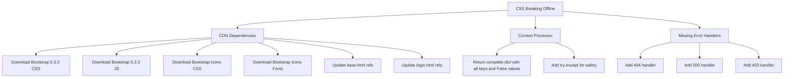

# Offline CSS Breaking - Root Cause Analysis & Fix Plan

## Problem
Uygulama internetsiz bir dükkanda kullanılıyor. Admin kullanıcısı ile sorunsuz çalışıyor, ancak yeni bir kullanıcı oluşturulup giriş yapıldığında tüm CSS bozuluyor, sayfa beraber karışık görünüyor.

## Root Cause Analysis

### 🔴 PRIMARY CAUSE: CDN Dependencies (Critical)

[`base.html`](templates/base.html:7) ve [`login.html`](templates/auth/login.html:7) dosyaları Bootstrap CSS, Bootstrap Icons CSS ve Bootstrap JS dosyalarını CDN'den yüklüyor:

```html
<!-- base.html line 7-8 -->
<link href="https://cdn.jsdelivr.net/npm/bootstrap@5.3.3/dist/css/bootstrap.min.css" rel="stylesheet">
<link href="https://cdn.jsdelivr.net/npm/bootstrap-icons@1.11.3/font/bootstrap-icons.css" rel="stylesheet">

<!-- base.html line 128 -->
<script src="https://cdn.jsdelivr.net/npm/bootstrap@5.3.3/dist/js/bootstrap.bundle.min.js"></script>

<!-- login.html line 7-8 (same CDN links) -->
<link href="https://cdn.jsdelivr.net/npm/bootstrap@5.3.3/dist/css/bootstrap.min.css" rel="stylesheet">
<link href="https://cdn.jsdelivr.net/npm/bootstrap-icons@1.11.3/font/bootstrap-icons.css" rel="stylesheet">

<!-- login.html line 50 -->
<script src="https://cdn.jsdelivr.net/npm/bootstrap@5.3.3/dist/js/bootstrap.bundle.min.js"></script>
```

**Internetsiz ortamda bu CDN istekleri başarısız olur.** Tarayıcı önbelleği admin oturumundan dolayıtemporary olarak çalışabilir, ancak önbellek temizlendiğinde veya yeni bir tarayıcı oturumunda CSS tamamen yüklenemez.

Sonuç: Grid sistemi yok, navbar düzgün çalışmıyor, card stilleri yok, flex layout bozulmuş → "berbat birbirine girmiş görüntü"

### 🟡 SECONDARY ISSUES

#### 1. `user_permissions` Context Processor - Empty Dict Handling
[`app.py:60-64`](app.py:60) - Authenticated olmayan kullanıcılar için boş dict döndürülüyor:

```python
@app.context_processor
def inject_user_permissions():
    if current_user.is_authenticated:
        return {'user_permissions': current_user.get_permissions()}
    return {'user_permissions': {}}  # Empty dict!
```

[`base.html`](templates/base.html:24) template'inde `user_permissions.can_view_transactions` gibi attribute erişimleri var. Boş dict ile `{}.can_view_transactions` Jinja2'de `Undefined` döndürür (falsy), ama hata fırlatmaz. Yine de, defensive coding için bu düzeltilmeli.

#### 2. Error Handler Eksikliği
Uygulamada custom error handler yok. Template rendering hatası veya permission hatası durumunda kullanıcı çirkin bir hata sayfası görür.

#### 3. WTF_CSRF_ENABLED True ama Formlarda CSRF Token Yok
[`config.py:40`](config.py:40) - `WTF_CSRF_ENABLED = True` set edilmiş ama formlarda CSRF token yok. Bu, form gönderimlerinin sessizce başarısız olmasına neden olabilir.

## Fix Plan



### Step 1: Vendor Bootstrap Locally

**Hedef klasör yapısı:**
```
static/
  vendor/
    bootstrap/
      css/bootstrap.min.css
      css/bootstrap.min.css.map
      js/bootstrap.bundle.min.js
      js/bootstrap.bundle.min.js.map
    bootstrap-icons/
      bootstrap-icons.css
      bootstrap-icons.css.map
      fonts/
        bootstrap-icons.woff
        bootstrap-icons.woff2
```

**Not:** Bootstrap Icons font dosyaları, CSS dosyasındaki `url("./fonts/...")` referansları nedeniyle `fonts/` alt klasöründe olmalıdır. İndirme sırasında dosya yolları korunmalıdır.

**Yöntem:** Dosyalar projeye elle kopyalanacak. İnternet olan makinede indirilip, flash bellek ile taşınabilir. Ya da bir download script ile otomatik indirilebilir.

### Step 2: Update Template References

**[`base.html`](templates/base.html)** değişiklikleri:
```html
<!-- ESKİ (CDN) -->
<link href="https://cdn.jsdelivr.net/npm/bootstrap@5.3.3/dist/css/bootstrap.min.css" rel="stylesheet">
<link href="https://cdn.jsdelivr.net/npm/bootstrap-icons@1.11.3/font/bootstrap-icons.css" rel="stylesheet">

<!-- YENİ (Local) -->
<link href="{{ url_for('static', filename='vendor/bootstrap/css/bootstrap.min.css') }}" rel="stylesheet">
<link href="{{ url_for('static', filename='vendor/bootstrap-icons/bootstrap-icons.css') }}" rel="stylesheet">

<!-- ESKİ (CDN JS) -->
<script src="https://cdn.jsdelivr.net/npm/bootstrap@5.3.3/dist/js/bootstrap.bundle.min.js"></script>

<!-- YENİ (Local JS) -->
<script src="{{ url_for('static', filename='vendor/bootstrap/js/bootstrap.bundle.min.js') }}"></script>
```

**[`login.html`](templates/auth/login.html)** - Aynı değişiklikler.

### Step 3: Fix Context Processor

**[`app.py`](app.py:60)** - Her zaman tüm key'leri içeren dict döndür:
```python
@app.context_processor
def inject_user_permissions():
    try:
        if current_user.is_authenticated:
            return {'user_permissions': current_user.get_permissions()}
    except Exception:
        pass
    return {
        'user_permissions': {
            'can_view_transactions': False,
            'can_add_transaction': False,
            'can_edit_transaction': False,
            'can_delete_transaction': False,
            'can_view_reports': False,
            'can_manage_users': False,
        }
    }
```

### Step 4: Add Error Handlers

**[`app.py`](app.py)** - Basit error handler'lar ekle:
```python
@app.errorhandler(404)
def not_found(e):
    return render_template('base.html', page_title='Sayfa Bulunamadı'), 404

@app.errorhandler(500)
def server_error(e):
    return render_template('base.html', page_title='Sunucu Hatası'), 500

@app.errorhandler(403)
def forbidden(e):
    return render_template('base.html', page_title='Erişim Engellendi'), 403
```

### Step 5: Add Download Script (Optional)

internet olan ortamda çalışacak bir `download_vendor.py` script'i yazılacak. Bu script, gerekli vendor dosyalarını `static/vendor/` altına indirecek. Böylece geliştirme ortamında `python download_vendor.py` çalıştırılarak dosyalar otomatik indirilebilir.

### Step 6: Update `.gitignore` / README

Vendor dosyalarının git'e eklenmesi ve README'de offline kullanım talimatlarının güncellenmesi.

## Implementation Order

1. ✅ Root cause analizi tamamlandı
2. ⬜ `download_vendor.py` script oluştur ve çalıştır
3. ⬜ `base.html` - CDN referanslarını local'e çevir
4. ⬜ `login.html` - CDN referanslarını local'e çevir  
5. ⬜ `app.py` - Context processor'ı fix et
6. ⬜ `app.py` - Error handler'ları ekle
7. ⬜ `requirements.txt` - gerekli paketleri güncelle (requests for download script)
8. ⬜ Offline test