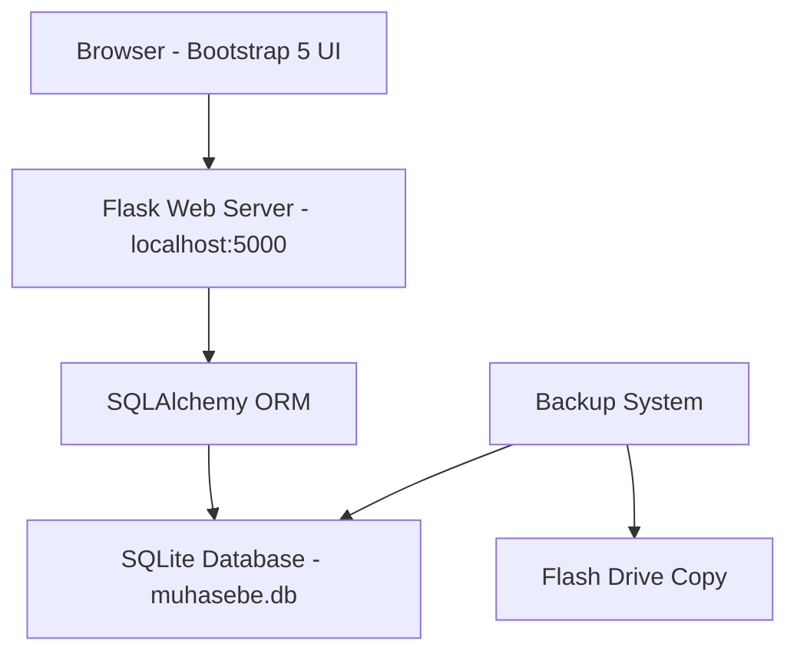

# MuhasebeDiyarı - Accounting Web Application Plan

## 1. Overview

A local accounting web application for a shop (Paspas Diyarı) to track income, expenses, gold conversions, cash register, and generate financial reports. The app runs offline with no internet dependency, using a single SQLite database file for easy manual backup via flash drive.

---

## 2. Technology Stack

| Layer | Technology | Reason |
|-------|-----------|--------|
| Backend | Python + Flask | Lightweight, easy to deploy locally |
| Database | SQLite | Single file, easy to copy for backup, no server needed |
| ORM | SQLAlchemy | Pythonic DB access, migrations support |
| Frontend | Bootstrap 5 + Jinja2 | Modern responsive UI, server-side rendering |
| Auth | Flask-Login | User session management |
| Charts | Chart.js | Monthly/yearly income-expense charts |
| PDF Export | WeasyPrint | For report printing |
| DB Migrations | Flask-Migrate / Alembic | Schema versioning |

---

## 3. Architecture



**Deployment:** Single-machine setup. Flask dev server runs on `localhost:5000`. A `start.bat` script launches everything.

---

## 4. Database Schema

### 4.1 Users Table
| Column | Type | Description |
|--------|------|-------------|
| id | Integer PK | Auto increment |
| username | String unique | Login name |
| password_hash | String | Bcrypt hashed password |
| full_name | String | Display name |
| is_admin | Boolean | Admin flag |
| is_active | Boolean | Account status |
| created_at | DateTime | Registration date |

### 4.2 Permissions Table
| Column | Type | Description |
|--------|------|-------------|
| id | Integer PK | Auto increment |
| user_id | FK Users | Related user |
| can_view_transactions | Boolean | View all transactions |
| can_add_transaction | Boolean | Add new transactions |
| can_edit_transaction | Boolean | Edit existing transactions |
| can_delete_transaction | Boolean | Delete transactions |
| can_view_reports | Boolean | View financial reports |
| can_manage_users | Boolean | Create/edit users |

### 4.3 Financiers / Payers Table - Odemelerde kim ödedi
| Column | Type | Description |
|--------|------|-------------|
| id | Integer PK | Auto increment |
| name | String unique | Hasan, Babam, Annem, Dükkan, Altın |

### 4.4 Categories Table
| Column | Type | Description |
|--------|------|-------------|
| id | Integer PK | Auto increment |
| name | String unique | Kira, Elektrik, Malzeme, Yakıt, etc. |
| type | String | Enum: expense, income, both |

### 4.5 Transactions Table - Ana işlem tablosu
| Column | Type | Description |
|--------|------|-------------|
| id | Integer PK | Auto increment |
| date | Date | Transaction date - allows past dates |
| entry_type | String | Enum: expense, income, gold_conversion, cash_note |
| description | String | Free text description |
| category_id | FK Categories | Category |
| total_amount | Float | Total transaction amount |
| payment_method | String | Enum: cash, credit_card_single, credit_card_installment |
| installment_count | Integer | Number of installments if credit card |
| installment_start_date | Date | First installment date |
| note | Text | Additional notes |
| created_by | FK Users | Who entered |
| created_at | DateTime | Auto timestamp |
| updated_at | DateTime | Last update |

### 4.6 Transaction Payers / Splits Table - Kim ne kadar ödedi
| Column | Type | Description |
|--------|------|-------------|
| id | Integer PK | Auto increment |
| transaction_id | FK Transactions | Parent transaction |
| financier_id | FK Financiers | Who paid |
| amount | Float | How much they paid |
| payment_method | String | Cash, credit_card, gold, etc. |
| installment_count | Integer | Installment count if applicable |
| note | String | E.g. altından gelen, kart peşin |

### 4.7 Cash Register Table - Kasa takibi
| Column | Type | Description |
|--------|------|-------------|
| id | Integer PK | Auto increment |
| date | Date | Date |
| transaction_id | FK Transactions | Related transaction |
| amount | Float | Net change amount |
| balance_after | Float | Running balance |
| description | String | Description |

---

## 5. Data Model Mapping from Sample Data

### Expense Entries: prefix #
```
#Kira - 20.000TL - Hasan
  → type: expense, category: Kira, total: 20000
  → payer: Hasan, amount: 20000, method: cash

#Tedaş - 1900TL - Hasan (faturaya ek gelecek kalan 1900)
  → type: expense, category: Elektrik, total: 1900
  → payer: Hasan, amount: 1900, method: cash
  → note: faturaya ek gelecek kalan 1900

#EVA Malzeme 97200 Babam (kart peşin)
  → type: expense, category: Malzeme, total: 97200
  → payer: Babam, amount: 97200, method: credit_card_single

#Dikiş Makinesi 34000 Babam (kart 6 taksit)
  → type: expense, category: Ekipman, total: 34000
  → payer: Babam, amount: 34000, method: credit_card_installment, installments: 6
```

### Income Entries: prefix +
```
+1000tl Bmw E36
  → type: income, description: Bmw E36, amount: 1000

+2000tl Golf5
  → type: income, description: Golf5, amount: 2000
```

### Gold Conversion Entries: prefix @
```
@ ALTIN BOZUM 5GR 34690
  → type: gold_conversion, gold_grams: 5, amount: 34690

@ 2 gr altın bozuldu annem kredi kartı ödemesi için 13408tl gönderildi
  → type: gold_conversion, gold_grams: 2, amount: 13408
  → note: annem kredi kartı ödemesi için
```

### Mixed Payer Entries: Complex split
```
#Lazer Makine 50.000 - 34.690 altın, 13.310 Hasan, 120.000 6 taksit Annem
  → type: expense, total: 50000 + 120000
  → Split into payer entries:
    - Altın: 34690, method: gold
    - Hasan: 13310, method: cash
  → Separate entry for Annem:
    - Annem: 120000, method: credit_card_installment, installments: 6
```

---

## 6. Features & UI Pages

### 6.1 Authentication
- Login page
- Admin default user created on first setup
- Session management

### 6.2 Dashboard - Ana Sayfa
- Current month summary cards: total income, total expense, net profit/loss
- Cash register current balance - Kasa bakiyesi
- Recent transactions list - Son işlemler
- Quick-add transaction buttons

### 6.3 Transaction Entry - İşlem Girişi
- Date picker - allows past dates
- Transaction type selector: Expense / Income / Gold Conversion / Cash Note
- Dynamic form that changes based on type:
  - **Expense:** description, category, total amount, single/multiple payers with amounts, payment method per payer, installment option
  - **Income:** description, amount
  - **Gold Conversion:** grams, amount, description of what gold was used for
  - **Cash Note:** narrative text, amount change if applicable
- Add/remove payer rows dynamically
- Save and add another button

### 6.4 Transaction List - İşlem Listesi
- Filterable by: date range, type, category, financier
- Sortable columns
- Edit/Delete with permission check
- Daily group headers - like the sample data format

### 6.5 Reports - Raporlar
- **Monthly Report:** Income vs Expense by month
- **Yearly Report:** Income vs Expense by year
- **Category Report:** Expenses grouped by category
- **Financier Report:** Who paid how much, outstanding balances
- **Gold Report:** Gold conversions, remaining gold value
- **Cash Register Report:** Running balance over time
- Charts: bar charts for monthly comparison, pie for category breakdown

### 6.6 User Management - Kullanıcı Yönetimi - Admin Only
- Create new users
- Set permissions per user
- Enable/disable accounts
- Change passwords

### 6.7 Backup - Yedekleme
- Download DB button: copies current SQLite file with timestamp
- Restore from backup: upload previous DB file
- Auto-backup reminder: notify every N days since last backup

---

## 7. Backup Strategy

Since the shop has **no internet** and backups must be **manual via flash drive**:

1. **SQLite single file**: The entire database is one file `muhasebe.db` - easily copyable
2. **One-click backup download**: Button in UI that creates a timestamped copy like `muhasebe_20260609_120000.db`
3. **Flash drive workflow**: User clicks backup → downloads file → copies to flash drive
4. **Data security**: The DB file IS the data - whoever has the file has all data. This matches the requirement
5. **Restore**: User uploads a previous `.db` file to restore from backup
6. **Auto-backup notification**: App reminds user if no backup was made in 7 days
7. **Alternative suggestion**: Keep 2 flash drives, alternate between them for redundancy

---

## 8. Project Structure

```
MuhasebeDiyarı/
├── app.py                  # Flask app factory and config
├── requirements.txt        # Python dependencies
├── start.bat              # Windows startup script
├── config.py              # Configuration
├── models/
│   ├── __init__.py
│   ├── user.py            # User + Permission models
│   ├── transaction.py     # Transaction + TransactionPayer models
│   ├── category.py        # Category model
│   ├── financier.py       # Financier model
│   └── cash_register.py   # Cash register model
├── routes/
│   ├── __init__.py
│   ├── auth.py            # Login/logout routes
│   ├── dashboard.py       # Dashboard routes
│   ├── transactions.py    # Transaction CRUD routes
│   ├── reports.py         # Report routes
│   ├── users.py           # User management routes
│   └── backup.py          # Backup/restore routes
├── templates/
│   ├── base.html           # Bootstrap layout
│   ├── auth/
│   │   └── login.html
│   ├── dashboard/
│   │   └── index.html
│   ├── transactions/
│   │   ├── list.html
│   │   ├── add.html
│   │   └── edit.html
│   ├── reports/
│   │   ├── monthly.html
│   │   ├── yearly.html
│   │   ├── category.html
│   │   ├── financier.html
│   │   ├── gold.html
│   │   └── cash_register.html
│   └── users/
│       ├── list.html
│       └── manage.html
├── static/
│   ├── css/
│   │   └── custom.css
│   ├── js/
│   │   └── app.js         # Dynamic forms, AJAX helpers
│   └── img/
├── migrations/             # Alembic migrations
└── instance/
    └── muhasebe.db         # SQLite database file - created at runtime
```

---

## 9. Implementation Steps - Todo List

1. Set up Flask project structure with dependencies
2. Create database models - User, Permission, Category, Financier, Transaction, TransactionPayer, CashRegister
3. Implement authentication - login/logout with Flask-Login
4. Create admin setup - seed default admin user and default categories/financiers
5. Build base template with Bootstrap 5 navigation
6. Implement transaction entry form with dynamic payer rows and payment method selection
7. Implement transaction list with filtering and grouping
8. Build dashboard with summary cards and recent transactions
9. Implement monthly and yearly reports with Chart.js
10. Implement category, financier, gold, and cash register reports
11. Build user management page for admin - create users, set permissions
12. Implement backup download and restore functionality
13. Add auto-backup reminder notification
14. Create start.bat launch script
15. Test with sample data from requirements
16. Polish UI/UX - responsiveness, confirmation dialogs, Turkish language throughout

---

## 10. UI Wireframe Notes

- **Language: Turkish** throughout the interface
- **Color scheme:** Professional dark blue sidebar, white content area
- **Navigation:** Left sidebar with icons
  - Ana Sayfa - Dashboard
  - İşlem Girişi - Add Transaction
  - İşlemler - Transaction List
  - Raporlar - Reports dropdown: Monthly, Yearly, Category, Financier, Gold, Cash Register
  - Kullanıcılar - User Management - Admin only
  - Yedekle - Backup
- **Tables:** Sortable, filterable, with export to PDF option
- **Forms:** Modern card-based layout with clear labels and validation