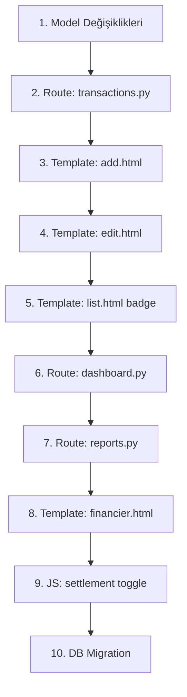

# Mahsuplaşma (Inter-Financier Settlement) Feature Plan

## Problem Statement

Finansörler arası mahsuplaşma yapılamıyor. Örnek senaryo:

- Hasan toplam 50,000 TL harcamış
- Babam toplam 100,000 TL harcamış  
- Hasan, Babam'a 5,000 TL veriyor (mahsuplaşma)
- **Beklenen sonuç:** Hasan = 55,000 TL, Babam = 95,000 TL

Şu anda bu işlem türü mevcut değil.

## Current System Analysis

### Veri Modeli
- `Transaction.entry_type`: expense, income, gold_conversion, cash_note
- `Transaction.total_amount`: İşlem tutarı
- `TransactionPayer`: Her işlem için kim ne kadar ödediğini tutar (her zaman pozitif)
- `Financier` raporu: `SUM(TransactionPayer.amount)` GROUP BY financier

### Maraqueue
- `entry_type` string(16) → 'settlement' sığar
- `TransactionPayer.amount` Float → Negatif değer destekler
- UI: Payer rows masonry ile ekleniyor

## Design Decision

**Yeni `entry_type = 'settlement'`** eklenecek.

### Settlement Mekanizması

```
Transaction: entry_type='settlement', total_amount=5000, description='Hasan → Babam mahsuplaşma'

TransactionPayer 1: financier=Hasan,  amount=+5000  (Hasan'ın yükü artar)
TransactionPayer 2: financier=Babam, amount=-5000  (Babam'ın yükü azalır)
```

**Neden bu yaklaşım?**
- Financier raporu `SUM(amount)` yapınca otomatik doğru net tutarı verir
- Hasan: 50,000 + 5,000 = 55,000 ✓
- Babam: 100,000 - 5,000 = 95,000 ✓
- Kasa raporu ve aylık/yıllık raporlardan settlement çıkarılabilir çünkü `entry_type='settlement'` ile filtrelenebilir
- Mevcut TransactionPayer yapısına minimal değişiklik

### UI Tasarımı

`entry_type = 'settlement'` seçildiğinde:
- Category alanı gizlenir (opsiyonel kalır)
- Payer rows gizlenir
- Yeni "Mahsuplaşma Detayı" bölümü gösterilir:

```
┌─────────────────────────────────────────────┐
│  Mahsuplaşma Detayı                          │
│                                              │
│  Gönderen: [Hasan ▼]    ← Kim para veriyor?  │
│  Alıcı:    [Babam ▼]    ← Kim para alıyor?   │
│  Tutar:    [5000    ] ₺                      │
│  Ödeme Yöntemi: [Na rarely ▼]               │
│  Açıklama: [Hasan → Babam arası mahsuplaşma] │
└─────────────────────────────────────────────┘
```

Backend'de:
- `settlement_from` (gönderen) → TransactionPayer with **negative** amount
- `settlement_to` (alıcı) → TransactionPayer with **positive** amount
- `Transaction.total_amount` = settlement tutarı (pozitif)

## Implementation Steps



### Step 1: Model Değişiklikleri
- `Transaction.entry_type` yorum satırına 'settlement' ekle
- Veri tabanı değişikliği gerekmez (String(16) yeterli)

### Step 2: Route - transactions.py
- `add()`: settlement type'ı handle et
  - `settlement_from`, `settlement_to`, `settlement_amount` form field'larını oku
  - İki TransactionPayer oluştur: from=-amount, to=+amount
- `edit()`: Mevcut settlement'i düzenle
  - Settlement transaction için payer rows yerine settlement form göster

### Step 3: Template - add.html
- entry_type dropdown'a 'settlement' ekle: `<option value="settlement">Mahsuplaşma</option>`
- Settlement section ekle (gizli, JS ile toggle)
- JS: `toggleEntryType()` fonksiyonuna settlement gizle/göster mantığı ekle

### Step 4: Template - edit.html
- Aynı settlement section'ı ekle
- Mevcut settlement transaction'ı düzenlerken from/to/amount'ı önceden doldur

### Step 5: Template - list.html
- Settlement badge ekle: `<span class="badge bg-info text-dark">Mahsuplaşma</span>`
- Settlement satırlarında "Hasan → Babam: 5,000 ₺" formatında göster

### Step 6: Route - dashboard.py
- Settlement'ları expense/income toplamlarından hariç tut
- Ana sayfada "Son İşlemler" listesinde settlement' göster
- Opsiyonel: Dashboard'a "Son Mahsuplaşmalar" kartı ekle

### Step 7: Route - reports.py
- `monthly()`: Settlement'ları ayrı hesapla, expense/income toplamına dahil etme
- `yearly()`: Aynı şekilde
- `financier()`:  
  - Mevcut toplam zaten settlement'ları içerir (SUM ile negatif/pozitif netleşir)
  - Settlement detayını ayrıca göster
  - Filter'a 'settlement' ekle
- `cash_register()`: Settlement'ları hariç tut (gerçek para akışı değil)

### Step 8: Template - financier.html
- Her finansör için settlement sonrası net bakiyeyi göster
- Filter dropdown'a 'Mahsuplaşma' ekle

### Step 9: JavaScript
- `toggleEntryType()`: settlement seçildiğinde payer rows gizle, settlement section göster
- Settlement section'da financiers dropdown'ı doldur
- `changePayerLabels()`: settlement için label güncelle

### Step 10: DB Migration
- Flask-Migrate ile migration üret
- `flask db migrate -m "Add settlement entry type"`

## Ek Not: Chart.js CDN Sorunu

`templates/reports/financier.html` ve muhtemelen diğer rapor şablonları Chart.js'yi CDN'den yüklüyor. Bu da offline ortamda sorun çıkarır. Aynı Bootstrap gibi lokal vendor edilmesi gerekiyor.

## Dosya Değişiklikleri Özeti

| Dosya | Değişiklik |
|-------|-----------|
| `models/transaction.py` | Yorum: settlement type ekleme |
| `routes/transactions.py` | settlement create/edit handler |
| `routes/dashboard.py` | Settlement'ları hariç tut |
| `routes/reports.py` | Settlement filtreleme ve net hesaplama |
| `templates/transactions/add.html` | Settlement UI section + JS |
| `templates/transactions/edit.html` | Settlement UI section + JS |
| `templates/transactions/list.html` | Settlement badge |
| `templates/dashboard/index.html` | Settlement hariç tutma |
| `templates/reports/financier.html` | Settlement detayları |